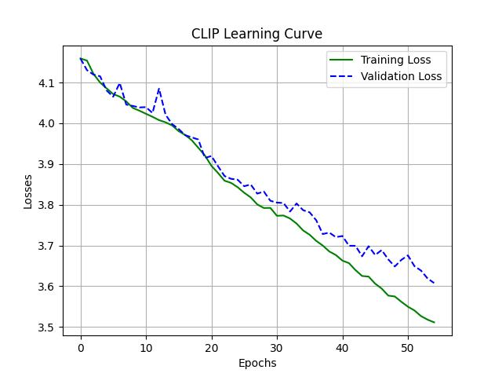
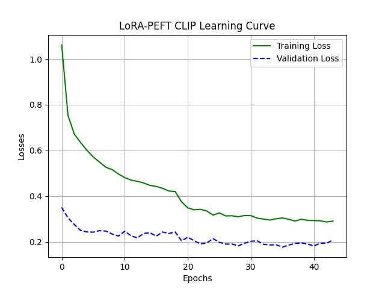

# A Deep Dive into CLIP: From-Scratch Implementation & PEFT Fine-Tuning 🈲 <-> 🌉

This repository documents a two-part research journey into OpenAI's CLIP model. The goal is to build a deep, first-principles understanding of multimodal systems, from foundational architecture to modern, efficient fine-tuning techniques.

-   **Part 1: From-Scratch Implementation.** A complete implementation of the CLIP architecture in PyTorch to understand its core mechanics.
-   **Part 2: PEFT Fine-Tuning Case Study.** An experimental analysis of using LoRA (Low-Rank Adaptation) to efficiently adapt a pre-trained CLIP model to a new dataset.

## Core Concepts of CLIP

CLIP (Contrastive Language-Image Pre-training) is a self-supervised model that learns visual representations from natural language. It uses a contrastive learning objective to align the vector representations of images and their corresponding text captions in a shared multimodal embedding space.

The training process involves:
1.  Encoding batches of (image, text) pairs using an **Image Encoder** (ViT) and a **Text Encoder** (Transformer).
2.  Projecting the outputs of both encoders into a shared embedding space.
3.  Calculating a cosine similarity matrix between all image and text embeddings in the batch.
4.  Using a **symmetric cross-entropy loss** to maximize the similarity for the `N` correct pairs (the diagonal) while minimizing it for the `N²-N` incorrect pairs (the off-diagonal).

---

## Part 1: From-Scratch Implementation

This first phase focused on building the entire CLIP architecture from scratch to gain a fundamental understanding of its components.

### Architecture Details

The from-scratch implementation consists of two main components:

| Encoder | Architecture | Layers | Heads | Embedding Dim | Parameters |
| :--- | :--- | :--- | :--- | :--- | :--- |
| **Image** | ViT-Base/16 | 12 | 12 | 768 | ~86M |
| **Text** | BERT-style Transformer | 12 | 8 | 512 | ~63M |

### From-Scratch Training & Results

Due to the immense compute required to train CLIP on its original dataset, this experiment was run on the smaller Flickr30k dataset (~31k images) for 55 epochs.

**Learning Curve (From Scratch):**

**Analysis:**
-   **Success:** The steady downward trend of the training loss confirms that the from-scratch implementation is correct and the model is successfully learning.
-   **Insight:** The noisy validation loss is a classic signature of training a very large model on a small dataset. This was a successful experimental replication of the core challenge described in the CLIP paper—demonstrating the model's data-hungry nature.

---

## Part 2: LoRA Fine-Tuning Case Study

This second phase focused on the modern, professional workflow of adapting a large, pre-trained model efficiently using Parameter-Efficient Fine-Tuning (PEFT) with LoRA.

### Experimental Setup

The goal was to move beyond theory and understand the practical impact of LoRA's configuration. After a first run with a low-rank (`r=8`) adapter resulted in underfitting, a second, successful run was completed with a higher-capacity configuration.

-   **Base Model:** Pre-trained `openai/clip-vit-base-patch16` (155M parameters).
-   **Dataset:** Flickr30k.
-   **Successful LoRA Config:** `rank=64`, `alpha=128`, targeting `q_proj`, `k_proj`, and `v_proj` layers.
-   **Trainable Parameters:** ~5.9M (**3.8%** of the total parameters).

### Fine-Tuning Results & Analysis

**Learning Curve (LoRA Fine-Tune):**

**Analysis & Key Insights:**

1.  **Powerful Zero-Shot Baseline:** The validation loss starts extremely low, proving the immense power of the pre-trained CLIP model before any fine-tuning was applied.
2.  **Efficient Adaptation:** The training loss starts high (due to the new, random LoRA adapter weights) but drops rapidly, showing the adapter learning the new task with impressive speed while training only ~4% of the total parameters.
3.  **Finding a Better Minima:** The higher-capacity `r=64` adapter successfully found a much better solution than the `r=8` run, which had been stuck in a local minimum. This demonstrates that more capacity led to a better result.
4.  **A Healthy, Regularized Fine-Tune:** The final state, with a low, stable validation loss and a consistently higher training loss, is a textbook example of effective regularization (like Dropout) making the training task harder to ensure the model generalizes better.

## Acknowledgment
- This project is based on the original paper: [Learning Transferable Visual Models From Natural Language Supervision by Alec Radford, et al.](https://arxiv.org/abs/2103.00020)
- This project utilises the Flicker30k Dataset released on: [Kaggle](https://www.kaggle.com/datasets/hsankesara/flickr-image-dataset)