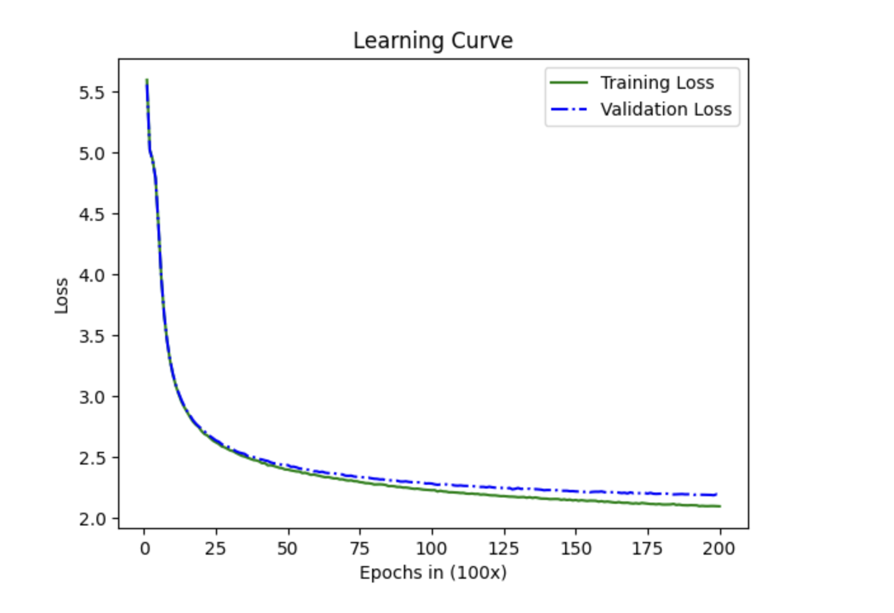

# From-Scratch GPT Implementation in PyTorch

This sub-repository contains a from-scratch implementation of a GPT (Generative Pre-trained Transformer) model in PyTorch. The goal of this project is to build a deep, first-principles understanding of the Transformer architecture as described in the paper "Attention Is All You Need."

## Motivation

This project was inspired by Andrej Karpathy's excellent "Let's build GPT" lecture and 3Blue1Brown's fantastic visualizations of the attention mechanism. While I had experience with TensorFlow, I wanted to learn the PyTorch API to align my skills with the current research landscape and move beyond high-level libraries to truly understand how these models work internally.

The implementation was scaled up from a toy example to a 13.1 million parameter model trained on a real-world dataset to explore the challenges of training and diagnosing a moderately-sized LLM.

## Important
- The model in `main.py` is the original scaled down version that was used to learn the concepts and train on my laptop.
- The **13.1 million** parameter model was scaled up based on the code in this repo and was ported into a Kaggle Notebook for training. It is available in the repo as `minigpt.ipynb`

## Key Features

-   **Modular Architecture:** The model is built using clean, modular `nn.Module` blocks for `SelfAttention`, `MultiHeadAttention`, `FeedForward`, and the main `GPTDecoderBlock`.
-   **From Scratch:** Core components like the self-attention mechanism and causal masking are implemented from the ground up.
-   **Scalable:** The model's hyperparameters (embedding size, number of heads, layers) are configurable, allowing for easy scaling.

## Model Architecture

The trained 13.1 million parameter model has the following architecture:

-   **Total Parameters:** 13,162,061
-   **Embedding Dimensions:** 384
-   **Decoder Blocks:** 8
-   **Attention Heads:** 6
-   **Context Length:** 256 tokens

## Learning Curve
