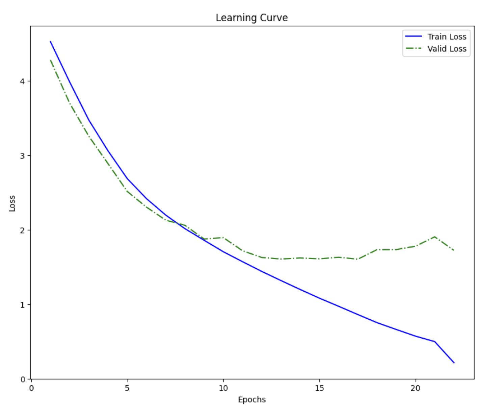
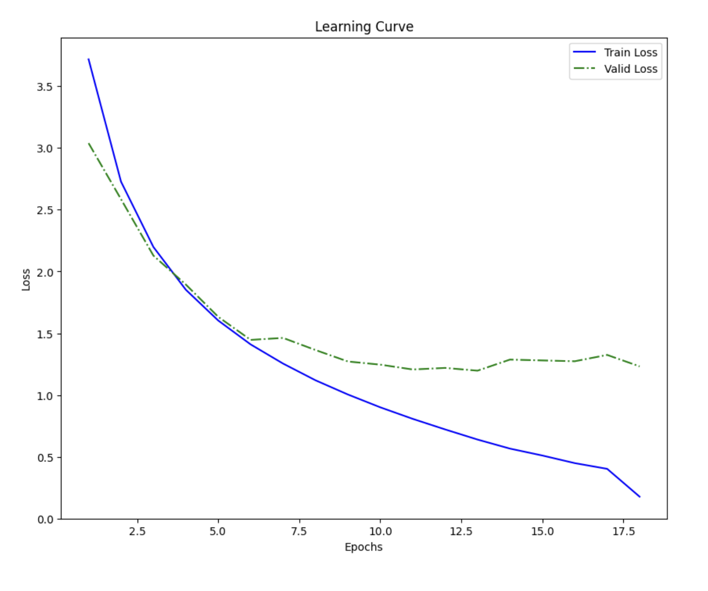

# ResNet Implementations (ResNet-34 & ResNet-50)

This repository provides custom PyTorch implementations of ResNet-34 and ResNet-50 models. These implementations are built from scratch, offering a clear understanding of their architectural components, including Basic Blocks (for ResNet-34) and Bottleneck Blocks (for ResNet-50), skip connections, and downsampling strategies. The project also includes a robust data handling pipeline and a flexible training loop to facilitate training and evaluation on image datasets. The project also provides a robust data pipeline and training loop to facilitate experimentation and understanding of Resnet's core mechanisms. The project aims to provide a controlled environment for comparing the training behavior, performance, and overfitting characteristics of the model in contrast to the ViT.

## ✨ Features

*   **Custom ResNet Architectures:**
    *   **ResNet-34:** Implemented using the standard Basic Block (two 3x3 convolutional layers) with correct stride and skip connections.
    *   **ResNet-50:** Implemented using the standard Bottleneck Block (1x1, 3x3, 1x1 convolutional layers) with correct stride and skip connections.
    *   **Modular Block Definitions:** Separate classes for `ResidualBlock34` and `ResidualLearningBlock` (for ResNet-50's Bottleneck Block).
*   **Robust Data Pipeline:** Handles image preprocessing (resizing, cropping, normalization) and efficient data loading via `DataLoader`. Supports stratified sampling for train/validation splits.
*   **Flexible Training Loop:** Features AdamW optimizer, `ReduceLROnPlateau` learning rate scheduler, early stopping, and model checkpointing.
*   **Distributed Training Ready:** Configured for `torch.nn.DataParallel` for multi-GPU training.
*   **Performance Visualization:** Generates learning curves to monitor training and validation loss.

## Learning Curve
### Resnet-34

### Resnet-50
